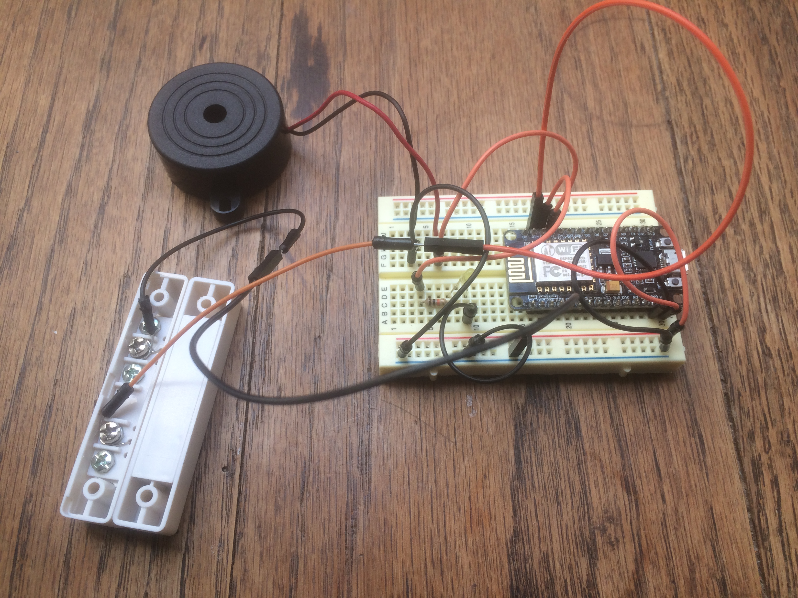
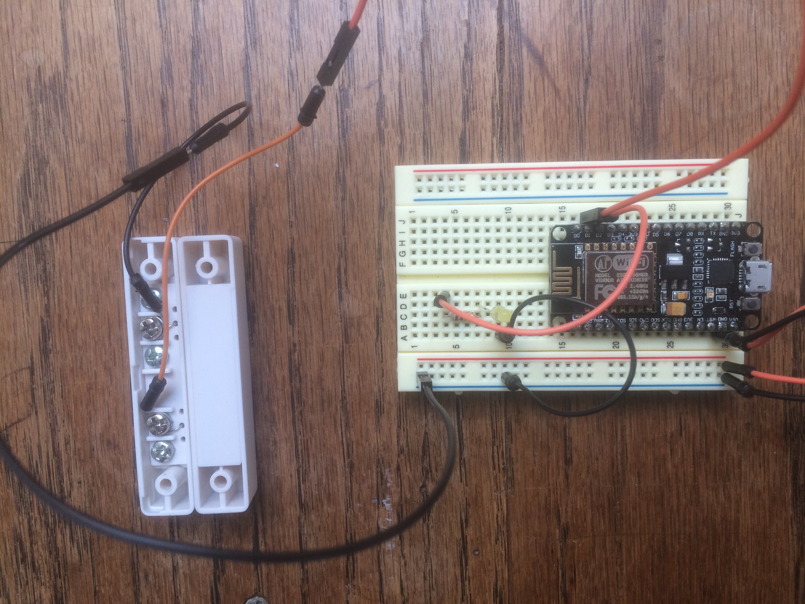
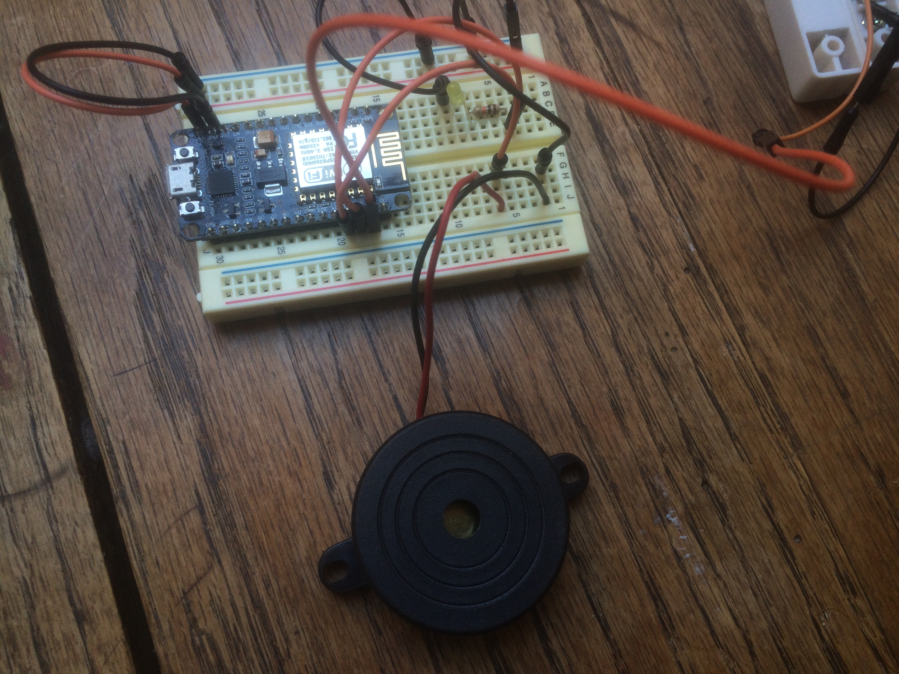
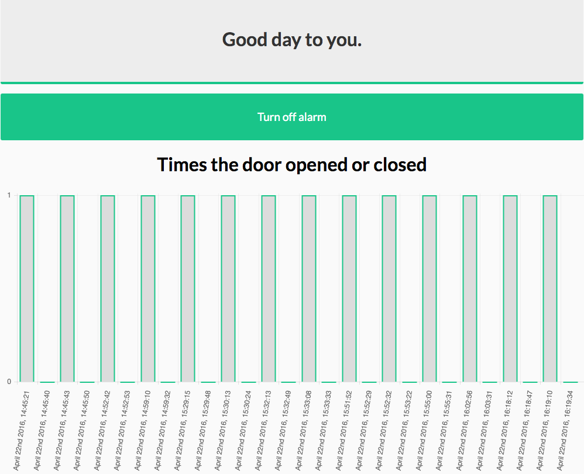

#Make your own door alarm.
## To keep anyone from forgetting to close it.

The purpose of this project is a thing that annoyed me about my mother. Most of the times when she goes to do some work in the garden she leaves the open. Now if we would live in a country where there is always nice weather this wouldn't be a problem, but we don't. So I thought why not build an alarm that lets her know that she left the door open to long and it is starting to get cold inside. The end result made me write this manual for the ones intrested in such a alarm.

At the end of this readme/manual you will have your very own door alarm which you can monitor through a server/browser.

The outcome will look something like this. 



### The hardware

Lets start with the hardware that is needed to complete this project. 

1. A buzzer or piezo, you can buy this [here.](http://www.hackerstore.nl/Artikel/230)
2. A set of jumper wires, you can buy those [here](http://www.hackerstore.nl/Artikel/39) and [here.](http://www.hackerstore.nl/Artikel/222)
3. An LED and resistors, you can buy those [here.](http://www.hackerstore.nl/Artikel/201)
4. An magnetic door switch, you can buy that [here.](http://www.hackerstore.nl/Artikel/299)
5. A breadboard, you can buy that [here.](http://www.hackerstore.nl/Artikel/29)
6. An NodeMCU, you can buy that [here.](http://www.hackerstore.nl/Artikel/806)

### The magnetic door switch (step 1). 

To connect the door switch to the NodeMCU and let a LED ligth up when the door is open I used the tutorial right [here](http://www.instructables.com/id/Magnetic-Door-Sensor-and-Arduino/?ALLSTEPS).

In this tutorial the switch is connected to an Arduino board, but we're connection it to an NodeMCU so the first thing we should change is the pin number our door switch and LED are connected to. In the image below I connected the door switch to pin (orange jumper wires) D1 and the LED to pin D2. We connect them to the D pins because these sensors give us digital in/output. The black jumper wires are connected to the ground. 



The following code lets us accomplish the first step. 

```javascript
const int switchPin = D1; // Here we say to which pin the door switch is connected.
const int ledPin = D2; // Here we say to which pin the LED is connected.

void setup() {

	pinMode(switchPin, INPUT_PULLUP);

	pinMode(ledPin, OUTPUT);

	digitalWrite(switchPin, HIGH);

}

void loop() {

	if(digitalRead(switchPin) == LOW){

		digitalWrite(ledPin, LOW);

	}

	else{

		digitalWrite(ledPin, HIGH);

	}

}
```

### The buzzer or piezo (step 2)

Connecting the buzzer or piezo is quite easy. Just look at the photo below and you can manage to succeed.



I connected the Buzzer, piezo to pin D3 and to the ground of the breadboard. The next step is to let it produce some sounds for us and how we do that will be treated in step 3.

### Let the alarm go off when the door opens (step 3)

Now the point of this alarm is that it will go off after a certain time of the door being open. So we don't want it to go off immediately.
To accomplish this we can use the millis() function, instead of using a delay. A delay will delay the rest of the code from running that is declared after it. Millis() doesn't give us this problem, but first we want our alarm (Buzzer or piezo) to make a sound when the door is open. For the sound it will produce I used to code provided in this [link](https://www.arduino.cc/en/tutorial/melody). There is also an good explanation of how the code works. So if we merge our previous code with this code the result will look like the code below.

```javascript
const int switchPin = D1; // Here we say to which pin the door switch is connected.
const int ledPin = D2; // Here we say to which pin the LED is connected.
int speakerPin = D3; // Here we say the buzzer or piezo is connected to pin D3.

// The melody declarations.
int length = 15; // the number of notes
char notes[] = "ccggaagffeeddc "; // a space represents a rest
int beats[] = { 1, 1, 1, 1, 1, 1, 2, 1, 1, 1, 1, 1, 1, 2, 4 };
int tempo = 300;

void playTone(int tone, int duration) {
  for (long i = 0; i < duration * 1000L; i += tone * 2) {
    digitalWrite(speakerPin, HIGH);
    delayMicroseconds(tone);
    digitalWrite(speakerPin, LOW);
    delayMicroseconds(tone);
  }
}

void playNote(char note, int duration) {
  char names[] = { 'c', 'd', 'e', 'f', 'g', 'a', 'b', 'C' };
  int tones[] = { 1915, 1700, 1519, 1432, 1275, 1136, 1014, 956 };

  // play the tone corresponding to the note name
  for (int i = 0; i < 8; i++) {
    if (names[i] == note) {
      playTone(tones[i], duration);
    }
  }
}

void setup() {

	pinMode(switchPin, INPUT_PULLUP);

	pinMode(ledPin, OUTPUT);

	digitalWrite(switchPin, HIGH);

	pinMode(speakerPin, OUTPUT);

}

void loop() {

	if(digitalRead(switchPin) == LOW){

		digitalWrite(ledPin, LOW);

	}

	else{

		digitalWrite(ledPin, HIGH);

		for (int i = 0; i < length; i++) {
		    if (notes[i] == ' ') {
		      delay(beats[i] * tempo); // rest
		    } else {
		      playNote(notes[i], beats[i] * tempo);
		    }

		    // pause between notes
		    delay(tempo / 2); 
		}

	}

}
```

### millis() (step 4)

As mentioned in step 3 we want to let the alarm go off after a certain time the door is open. This can be done with millis(). The only thing we have to do is make a simple mathmetical calculation, but first let me tell how millis() works. Once millis() is declared it will start running a time in milliseconds. We can use this time to calute and trigger certain events in the code without delaying the code. How the code is built up right now will not quite work for us, so we've got to refactor it a little. The main thing we will be refactoring is the void loop(). The code will look like the one below.

```javascript
const int switchPin = D1; // Here we say to which pin the door switch is connected.
const int ledPin = D2; // Here we say to which pin the LED is connected.
int speakerPin = D3; // Here we say the buzzer or piezo is connected to pin D3.

// The melody declarations.
int length = 15; // the number of notes
char notes[] = "ccggaagffeeddc "; // a space represents a rest
int beats[] = { 1, 1, 1, 1, 1, 1, 2, 1, 1, 1, 1, 1, 1, 2, 4 };
int tempo = 300;

// Interval is how long we wait for the alarm to go off.
int interval=5000;

// Tracks the time since last event fired.
unsigned long currentMillis=0;
unsigned long openMillis=0;

// Check if the door is open.
boolean isOpen = false;

void playTone(int tone, int duration) {
  for (long i = 0; i < duration * 1000L; i += tone * 2) {
    digitalWrite(speakerPin, HIGH);
    delayMicroseconds(tone);
    digitalWrite(speakerPin, LOW);
    delayMicroseconds(tone);
  }
}

void playNote(char note, int duration) {
  char names[] = { 'c', 'd', 'e', 'f', 'g', 'a', 'b', 'C' };
  int tones[] = { 1915, 1700, 1519, 1432, 1275, 1136, 1014, 956 };

  // play the tone corresponding to the note name
  for (int i = 0; i < 8; i++) {
    if (names[i] == note) {
      playTone(tones[i], duration);
    }
  }
}

void setup() {

	pinMode(switchPin, INPUT_PULLUP);

	pinMode(ledPin, OUTPUT);

	digitalWrite(switchPin, HIGH);

	pinMode(speakerPin, OUTPUT);

}

void loop() {
	
	// Here we declare that the current time is going to be millis(), so this is the point that millis starts running.
	currentMillis = millis();

	if(digitalRead(switchPin) == HIGH && !isOpen) {
    	isOpen = true;
    	openMillis = currentMillis;
  }

  if(digitalRead(switchPin) == LOW && isOpen) {
    	isOpen = false;
    	digitalWrite(ledPin, LOW);
  }
  
	// If the door has been open longer than 5 sec. it is okay to set off the alarm. 
  	if(currentMillis - openMillis >= interval && isOpen){
    
     	digitalWrite(ledPin, HIGH);
     	for (int i = 0; i < length; i++) {
      	if(digitalRead(switchPin) == HIGH && playCount <=2) {
        	if (notes[i] == ' ') {
          	delay(beats[i] * tempo); // rest
        } else {
          	playNote(notes[i], beats[i] * tempo);
        }
        // pause between notes
        delay(tempo / 2); 
      }
     }
  }

}
```

So we set the currentMillis and the openMillis to 0. Once the code starts in the void loop() currentMillis becomes millis.
We also use a check "isOpen" that can be true or false. So what we do here is say if the door is open and the boolean isOpen is true, then set isOpen to true and set openMillis, that was declared to be zero, to currentMillis. At this point currentMillis is still running and openMillis just copies the time it was given from that point. So if the door is open and the boolean isOpen is true we can do our mathmetical calculation and that goes as following. If currentMillis - openMillis is bigger or the same as interval (which we have set to be 5000) and isOpen (which is been set to true) are all true you can let the alarm go off. If we want to wait longer for the alarm to go off we can just set the interval state to a bigger number, lets say 7000. Then the alarm will wait 7 seconds before going off.

We can eventually say that we want the sound the play normal twice and after the second time speed it up. To accomplish this we add some extra code we'va already written and add a few extra things. The code below show how this can be achieved. 

```javascript
const int switchPin = D1; // Here we say to which pin the door switch is connected.
const int ledPin = D2; // Here we say to which pin the LED is connected.
int speakerPin = D3; // Here we say the buzzer or piezo is connected to pin D3.

// The melody declarations.
int length = 15; // the number of notes
char notes[] = "ccggaagffeeddc "; // a space represents a rest
int beats[] = { 1, 1, 1, 1, 1, 1, 2, 1, 1, 1, 1, 1, 1, 2, 4 };
int tempo = 300;

// Interval is how long we wait for the alarm to go off.
int interval=5000;

// Tracks the time since last event fired.
unsigned long currentMillis=0;
unsigned long openMillis=0;

// Check if the door is open.
boolean isOpen = false;

// The amount of times the melody has been played.
int playCount=0;

void playTone(int tone, int duration) {
  for (long i = 0; i < duration * 1000L; i += tone * 2) {
    digitalWrite(speakerPin, HIGH);
    delayMicroseconds(tone);
    digitalWrite(speakerPin, LOW);
    delayMicroseconds(tone);
  }
}

void playNote(char note, int duration) {
  char names[] = { 'c', 'd', 'e', 'f', 'g', 'a', 'b', 'C' };
  int tones[] = { 1915, 1700, 1519, 1432, 1275, 1136, 1014, 956 };

  // play the tone corresponding to the note name
  for (int i = 0; i < 8; i++) {
    if (names[i] == note) {
      playTone(tones[i], duration);
    }
  }
}

void setup() {

	pinMode(switchPin, INPUT_PULLUP);

	pinMode(ledPin, OUTPUT);

	digitalWrite(switchPin, HIGH);

	pinMode(speakerPin, OUTPUT);

}

void loop() {
	
	// Here we declare that the current time is going to be millis(), so this is the point that millis starts running.
	currentMillis = millis();

	if(digitalRead(switchPin) == HIGH && !isOpen) {
    	isOpen = true;
    	openMillis = currentMillis;
  }

  if(digitalRead(switchPin) == LOW && isOpen) {
    	isOpen = false;
    	digitalWrite(ledPin, LOW);
    	playCount=0;
  }
  
	// If the door has been open longer than 5 sec. it is okay to set off the alarm. 
  	if(currentMillis - openMillis >= interval && isOpen){
    	
    	playCount++;
     	digitalWrite(ledPin, HIGH);
     	for (int i = 0; i < length; i++) {
      	if(digitalRead(switchPin) == HIGH && playCount <=2) {
        	if (notes[i] == ' ') {
          	delay(beats[i] * tempo); // rest
        } else {
          	playNote(notes[i], beats[i] * tempo);
        }
        // pause between notes
        delay(tempo / 2); 
      }
     }
  }

  if(playCount >=2){ 
    	for (int i = 0; i < length; i++) {
      	if(digitalRead(switchPin) == HIGH) {
        	if (notes[i] == ' ') {
          	delay(beats[i] * tempo); // rest
        } else {
          	playNote(notes[i], beats[i] * tempo / 2);
        }
        // pause between notes
        delay(tempo / 2); 
      }
     }     
  }
}
```

So we declared a playCount=0; This keeps track how many times the sound played or alarm went off. Each time the door is closed playCount is set to 0, but if the door is open and the alarm starts playinh we increase playCount by 1. When playCount is 2 we can use the new piece of code to play the alarm faster. In that if statement we check if playCount is equal to or bigger than 2 if that is true we play the alarm sound but we play it twice as fast. As you can see we can do this by dividing temp by 2. 

### Connecting our NodeMCU to WiFi (step 5)

For this setup I made us of the following link [here](https://github.com/esp8266/Arduino/blob/master/libraries/ESP8266WiFi/examples/WiFiClientBasic/WiFiClientBasic.ino).

To use this code you should include the ESP8266WiFi.h library. You can use your own hotspot or home WiFi to connect to with the following code.
```javascript
// Libraries used in the code
#include <ESP8266WiFi.h>

const int switchPin = D1; // Here we say to which pin the door switch is connected.
const int ledPin = D2; // Here we say to which pin the LED is connected.
int speakerPin = D3; // Here we say the buzzer or piezo is connected to pin D3.

// The melody declarations.
int length = 15; // the number of notes
char notes[] = "ccggaagffeeddc "; // a space represents a rest
int beats[] = { 1, 1, 1, 1, 1, 1, 2, 1, 1, 1, 1, 1, 1, 2, 4 };
int tempo = 300;

// Interval is how long we wait for the alarm to go off.
int interval=5000;

// Tracks the time since last event fired.
unsigned long currentMillis=0;
unsigned long openMillis=0;

// Check if the door is open.
boolean isOpen = false;

// The amount of times the melody has been played.
int playCount=0;

// Connection to WiFi.
const char* ssid     = "********"; // Fill in your own SSID.
const char* password = "********"; // Fill in your password.

void playTone(int tone, int duration) {
  for (long i = 0; i < duration * 1000L; i += tone * 2) {
    digitalWrite(speakerPin, HIGH);
    delayMicroseconds(tone);
    digitalWrite(speakerPin, LOW);
    delayMicroseconds(tone);
  }
}

void playNote(char note, int duration) {
  char names[] = { 'c', 'd', 'e', 'f', 'g', 'a', 'b', 'C' };
  int tones[] = { 1915, 1700, 1519, 1432, 1275, 1136, 1014, 956 };

  // play the tone corresponding to the note name
  for (int i = 0; i < 8; i++) {
    if (names[i] == note) {
      playTone(tones[i], duration);
    }
  }
}

void setup() {

	pinMode(switchPin, INPUT_PULLUP);

	pinMode(ledPin, OUTPUT);

	digitalWrite(switchPin, HIGH);

	pinMode(speakerPin, OUTPUT);

	Serial.begin(9600);
  	delay(10);
  	Serial.print("Connecting to ");
  	Serial.println(ssid);

  	WiFi.begin(ssid, password);
  	int wifi_ctr = 0;
  	while (WiFi.status() != WL_CONNECTED) {
      	delay(500);
      	Serial.print(".");
  	}

  	Serial.println("WiFi connected");
  	Serial.println("IP address: " + WiFi.localIP());

}

void loop() {
	
	// Here we declare that the current time is going to be millis(), so this is the point that millis starts running.
	currentMillis = millis();

	if(digitalRead(switchPin) == HIGH && !isOpen) {
    	isOpen = true;
    	openMillis = currentMillis;
  }

  if(digitalRead(switchPin) == LOW && isOpen) {
    	isOpen = false;
    	digitalWrite(ledPin, LOW);
    	playCount=0;
  }
  
	// If the door has been open longer than 5 sec. it is okay to set off the alarm. 
  	if(currentMillis - openMillis >= interval && isOpen){
    	
    	playCount++;
     	digitalWrite(ledPin, HIGH);
     	for (int i = 0; i < length; i++) {
      	if(digitalRead(switchPin) == HIGH && playCount <=2) {
        	if (notes[i] == ' ') {
          	delay(beats[i] * tempo); // rest
        } else {
          	playNote(notes[i], beats[i] * tempo);
        }
        // pause between notes
        delay(tempo / 2); 
      }
     }
  }

  // Play the alarm twice as fast.
  if(playCount >=2){ 
    	for (int i = 0; i < length; i++) {
      	if(digitalRead(switchPin) == HIGH) {
        	if (notes[i] == ' ') {
          	delay(beats[i] * tempo); // rest
        } else {
          	playNote(notes[i], beats[i] * tempo / 2);
        }
        // pause between notes
        delay(tempo / 2); 
      }
     }     
  }
}
```

### POST and GET request (step 6)

Before we can do a POST and a GET request we have to setup a server. You can do this with node or if you're lucky you have your own domain and you could just make a folder there where you can store your files. To use POST and GET request you have to include the ESP8266HTTPClient.h and the ArduinoJson.h library because we are also going to work with the JSON format. To set this up I used this [tutorial](https://github.com/esp8266/Arduino/blob/master/libraries/ESP8266HTTPClient/examples/BasicHttpClient/BasicHttpClient.ino) and this [tutorial](https://github.com/bblanchon/ArduinoJson/blob/master/examples/JsonParserExample/JsonParserExample.ino) First we are going to set up the GET and the POST in our NodemCU code and then we will go to the PHP part to round things up. Our code will look like the code below. 

```javascript
// Libraries used in the code
#include <ESP8266WiFi.h>
#include <ArduinoJson.h>
#include <ESP8266HTTPClient.h>

const int switchPin = D1; // Here we say to which pin the door switch is connected.
const int ledPin = D2; // Here we say to which pin the LED is connected.
int speakerPin = D3; // Here we say the buzzer or piezo is connected to pin D3.

// The melody declarations.
int length = 15; // the number of notes
char notes[] = "ccggaagffeeddc "; // a space represents a rest
int beats[] = { 1, 1, 1, 1, 1, 1, 2, 1, 1, 1, 1, 1, 1, 2, 4 };
int tempo = 300;

// Interval is how long we wait for the alarm to go off.
int interval=5000;

// Tracks the time since last event fired.
unsigned long currentMillis=0;
unsigned long openMillis=0;

// Check if the door is open.
boolean isOpen = false;

// The amount of times the melody has been played.
int playCount=0;

// Connection to WiFi.
const char* ssid     = "********"; // Fill in your own SSID.
const char* password = "********"; // Fill in your password.

// The hosts we're using for the GET and the POST request.
String host = "http://www.yourdomain.com/IoT/";
String host2 = "http://www.yourdomain.com/IoT/door.json";

void playTone(int tone, int duration) {
  for (long i = 0; i < duration * 1000L; i += tone * 2) {
    digitalWrite(speakerPin, HIGH);
    delayMicroseconds(tone);
    digitalWrite(speakerPin, LOW);
    delayMicroseconds(tone);
  }
}

void playNote(char note, int duration) {
  char names[] = { 'c', 'd', 'e', 'f', 'g', 'a', 'b', 'C' };
  int tones[] = { 1915, 1700, 1519, 1432, 1275, 1136, 1014, 956 };

  // play the tone corresponding to the note name
  for (int i = 0; i < 8; i++) {
    if (names[i] == note) {
      playTone(tones[i], duration);
    }
  }
}

HTTPClient http;

// Function to POST the door value to the server, this can be 0(door closed) or 1(door open).
void sendValue(int value) {
  Serial.println(value);
  http.begin(host);
  http.addHeader("Content-Type", "application/x-www-form-urlencoded");

  String payload = "value=" + String(value);

  int httpCode = http.POST(payload);

  if (httpCode > 0) {
    Serial.println("POST request gelukt");
    String response = http.getString();
    Serial.println(response);
  } else {
    Serial.println(http.errorToString(httpCode).c_str());
  }

  http.end();
}

// Function to GET the door value from the server, this is a JSON format so this is where we use the JSON library.
String getValue() {
  http.begin(host2);
  int httpCode = http.GET();

  if (httpCode > 0) {
    String response = http.getString();
    Serial.print("Server waarde");
    Serial.println(response);
    delay(1000);
    StaticJsonBuffer<200> jsonBuffer;

    JsonObject& root = jsonBuffer.parseObject(response);
    String doorStatus = root["door"];
    Serial.println(doorStatus);
    return doorStatus;
  } else {
    Serial.println(http.errorToString(httpCode).c_str());
  }

  http.end();
}

void setup() {

	pinMode(switchPin, INPUT_PULLUP);

	pinMode(ledPin, OUTPUT);

	digitalWrite(switchPin, HIGH);

	pinMode(speakerPin, OUTPUT);

	Serial.begin(9600);
  	delay(10);
  	Serial.print("Connecting to ");
  	Serial.println(ssid);

  	WiFi.begin(ssid, password);
  	int wifi_ctr = 0;
  	while (WiFi.status() != WL_CONNECTED) {
      	delay(500);
      	Serial.print(".");
  	}

  	Serial.println("WiFi connected");
  	Serial.println("IP address: " + WiFi.localIP());

}

void loop() {
	
	// Here we declare that the current time is going to be millis(), so this is the point that millis starts running.
	currentMillis = millis();

	delay(1000);
  	String doorStatus;
  	doorStatus = getValue();
  	Serial.print("I'm status in the loop: ");
  	Serial.println(doorStatus);

	if(digitalRead(switchPin) == HIGH && !isOpen) {
    	isOpen = true;
    	openMillis = currentMillis;
    	sendValue(1)
  }

  if(digitalRead(switchPin) == LOW && isOpen) {
    	isOpen = false;
    	digitalWrite(ledPin, LOW);
    	playCount=0;
    	sendValue(0)
  }
  
	// If the door has been open longer than 5 sec. it is okay to set off the alarm. 
  	if(currentMillis - openMillis >= interval && isOpen && doorStatus == String("open")){
    	
    	playCount++;
     	digitalWrite(ledPin, HIGH);
     	for (int i = 0; i < length; i++) {
      	if(digitalRead(switchPin) == HIGH && playCount <=2) {
        	if (notes[i] == ' ') {
          	delay(beats[i] * tempo); // rest
        } else {
          	playNote(notes[i], beats[i] * tempo);
        }
        // pause between notes
        delay(tempo / 2); 
      }
     }
  }

  // Play the alarm twice as fast.
  if(playCount >=2 && doorStatus == String("open")){ 
    	for (int i = 0; i < length; i++) {
      	if(digitalRead(switchPin) == HIGH) {
        	if (notes[i] == ' ') {
          	delay(beats[i] * tempo); // rest
        } else {
          	playNote(notes[i], beats[i] * tempo / 2);
        }
        // pause between notes
        delay(tempo / 2); 
      }
     }     
  }
}
```

In the code above we are doing a GET request to host2 which is www.yourdomain.com/IoT/door.json. This file contains the status of the door. Either it is open or closed. Thanks to the JSON library we can decode this to a string in the GET function and store this in the doorStatus. The value of doorStatus is used in the void loop() as an extra check to make sure the alarm can go off, because in the browser we give the user an option to turn of the alarm e.d. it to being nice weather outside and you just want to chill in your garden. If the user does that the doorStatus isn't open, but closed. In PHP we write away what the status is in the door.json file on the server. 

In the POST request we send a value to the server, as you can see in the void loop(), this value can contain 1 or 0. The 1 meaning the door is open and the 0 meaning the door is closed. Our index.php responds to this POST request, but more about that in the following step. So now we are done with programming for the NodeMCU and ready to start programming PHP for our browser the user can interact with. 

### Time for some PHP (step 7)
#### Post request in PHP

As mentioned above we send (POST) something to the server and we retrieve (GET) something from the server. The way we do that is by using PHP. For this project we create three files:

1. index.php (which handles the POST and the GET, but also stores our html and some JavaScript.)
2. door.json
3. history.json

Lets start with the POST request. The code in our index.php looks like this:

```javascript
// Check if this is a post request
if ($_SERVER['REQUEST_METHOD'] === 'POST') {
  $value = $_POST['value'];
  $status = ($value === '1') ? 'open' : 'closed';

  // Status
  $file = fopen("door.json", "w+") or die("can't open file");
  fwrite($file, '{"door": "' . $status . '"}');
  fclose($file);

  // History
  $content = json_decode(file_get_contents('history.json'));
  $content[] = (['status' => $status, 'created_at' => time()]);
  $history = fopen("history.json", "w+") or die("can't open file");
  fwrite($history, json_encode($content));

}
```
It checks if it is a POST request, when it is a POST request we store the post value, which can be 1 or 0 in a variable called $value. 
If the value is equal to 1 we fill the $status variable with the value of open. If the value is not equeal to 1 we fill the $status variable with the value closed.
After this we open the door.json file and change the door valeu to the given value in the $status variable. Then we decode the history.json so that it is writeble for PHP. We fill the satus in the history file with the $status variable and for the created_at we give a new time. When this is done we encode the history.json file to be JSON again. 

#### Get request in PHP

As seen in the code above everything is put in an if statement, so logic would be that when there isn't a POST request there could be a GET request. The else statement there by will contain our GET request. The code looks like following:

```javascript
else {

  $door = $_GET['door'];
  if($door == "open") {  
    $file = fopen("door.json", "w+") or die("can't open file");
    fwrite($file, '{"door": "open"}');
    fclose($file);
  } 
  else if ($door == "closed") {  
    $file = fopen("door.json", "w") or die("can't open file");

    $new = '{"door": "closed"}';
    fwrite($file, $new);
    fclose($file);
  }


  $content = json_decode(file_get_contents('door.json'));
  $doorStatus = $content->door;
}
```

The GET request checks what the value of door is in the door.json file depending of what was send in the POST request. Our GET request in the NodeMCU code checks the contents of this file to check if it can play the alarm or not. 

### Displaying it in the browser (step 8)

To wrap things up we can display our door data in the browser and let the user turn off the alarm if they want to. The following code will help you set this up. This code includes the PHP POST and GET methods.

```javascript
<?php

// Check if this is a post request
if ($_SERVER['REQUEST_METHOD'] === 'POST') {
  $value = $_POST['value'];
  $status = ($value === '1') ? 'open' : 'closed';

  // Status
  $file = fopen("door.json", "w+") or die("can't open file");
  fwrite($file, '{"door": "' . $status . '"}');
  fclose($file);

  // History
  $content = json_decode(file_get_contents('history.json'));
  $content[] = (['status' => $status, 'created_at' => time()]);
  $history = fopen("history.json", "w+") or die("can't open file");
  fwrite($history, json_encode($content));

} else {

  $door = $_GET['door'];
  if($door == "open") {  
    $file = fopen("door.json", "w+") or die("can't open file");
    fwrite($file, '{"door": "open"}');
    fclose($file);
  } 
  else if ($door == "closed") {  
    $file = fopen("door.json", "w") or die("can't open file");

    $new = '{"door": "closed"}';
    fwrite($file, $new);
    fclose($file);
  }


  $content = json_decode(file_get_contents('door.json'));
  $doorStatus = $content->door;
}
  ?>

  <html>  
    <head>      
      <meta charset="utf-8">
      <meta http-equiv="X-UA-Compatible" content="IE=edge">
      <meta name="viewport" content="width=device-width, initial-scale=1">
      <link rel="stylesheet" type="text/css" href="style.css">
      <script type="text/javascript" src="https://cdnjs.cloudflare.com/ajax/libs/Chart.js/1.0.2/Chart.js"></script>
      <script src="https://cdnjs.cloudflare.com/ajax/libs/jquery/3.0.0-beta1/jquery.min.js"></script>
      <script src="https://cdnjs.cloudflare.com/ajax/libs/moment.js/2.13.0/moment.min.js"></script>
      <title>Close the door!</title>

    </head>
    <body>
      <div class="content-wrapper">

        <div class="melding">
          <h1>
            <?php
              if($door=="open") {
                echo("Door is open too long!");
              }
              else if ($door=="closed") {
                echo("The alarm is off.");
              }
              else{
                echo ("Good day to you.");
              }
            ?>
          </h1>
        </div>
        <div>
        </div>
        <div class="btns">
          <div class="btnOff">
            <a href="?door=closed">Turn off alarm</a>
          </div>
        </div>
        <h1 id="chart">Times the door opened or closed</h1>
        <canvas id="myChart"></canvas>
    </div>
    </body>

    <script>

$.ajax({
 url:'history.json',
 success: function (data) {
   var values = data.map(function(d) { return (d.status === 'open') ? 1 : 0 });
   var timestamps = data.map(function(d) { return moment.unix(d.created_at).format('MMMM Do YYYY, H:mm:ss ') });

   var data = {
       labels: timestamps,
       datasets: [
       {
         fillColor: "rgba(102,102,102,0.2)",
         strokeColor: "rgba(25,197,137,1)",
         pointColor: "rgba(102,102,102,1)",
         pointStrokeColor: "#19c589",
         pointHighlightFill: "#666",
         pointHighlightStroke: "rgba(102,102,102,1)",
         data: values
       }
       ]
     };

     var ctx = document.getElementById("myChart").getContext("2d");
     var myLineChart = new Chart(ctx).Bar(data);

 }
});

    </script>

  </html>

<?php
}
?>
```

I used some JavaScript and chart.js to make a chart which displays the data and [moment.js](http://momentjs.com/docs/) to translate the timestamps to readable text. How to get started on that you can visit the [chart.js](http://www.chartjs.org/docs/) website. Eventually this is what it looks like.



## Referance

1. [Door sensor:](http://www.instructables.com/id/Magnetic-Door-Sensor-and-Arduino/?ALLSTEPS) This link helped me to start this project. This manual described how you can turn a led on or off depending if the door is opened or closed. Great link to get you started and now it is basically the foundation of my alarm.

2. [Melody:](https://www.arduino.cc/en/tutorial/melody) This link helped me to let my buzzer play a sound. It is a standard code I found at the arduino website and this is the sound you here when my alarm goes off. 

3. [Wifi:](https://github.com/esp8266/Arduino/blob/master/libraries/ESP8266WiFi/examples/WiFiClientBasic/WiFiClientBasic.ino) This link helped me set up my WiFi connection from the NodeMCU to the hotspot I made with my smartphone. Without this piece of code my connection to the server wouldn't even be possible. 

4. [HTTP:](https://github.com/esp8266/Arduino/blob/master/libraries/ESP8266HTTPClient/examples/BasicHttpClient/BasicHttpClient.ino) This link helped me set up the POST and GET request I needed to do to the server. Without this library and the example code I wouldn't be able to let my project rely on user input.

5. [JSON:](https://github.com/bblanchon/ArduinoJson/blob/master/examples/JsonParserExample/JsonParserExample.ino) This link helped me decode the door.json value in my NodeMCU code to a string. Thanks to this library the user can turn of the alarm in the browser and my NodeMCU can react to this via the GET request.

Eventually I espacially want to thank [kasszz](https://github.com/kasszz) for helping me with setting up the millis() function and [reauv](https://github.com/reauv/minor-web-app-from-scratch) for helping me with the PHP. 

